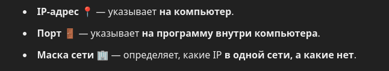

## NGINX

**nginx** is an open-source reverse proxy server for HTTP, HTTPS. **ngnix**  is  also used as a load balancer, web server and for HTTP caching. The nginx projects focuses ont high parallelism high performance and low memory usage.

**nginx** has one main process and several worker processes. The primary task of the main process is to read and check the configuration and manage the worker processes. The worker processes perform the actual processing of the requests.

How **nginx** and its modules work is defined and in the configuration file. By default, the configuration file is called nginx.conf. It is structured into two main contexts the event and HTTP context. The config file contains the following.

- **Worker processes** The defines the number of worker processes NGNIX will use
- **Worker connections** This is the maximum number of simultaneous connections for each worker process. It tells NGINX how many people it can serve.

### The NGINX Architecture

By implementing event-driven, asynchronous, and non-blocking models. NGINX uses master-slave architecture.

It also uses an advanced event-based mechanism in many operation systems. Additionally NGINX uses multiplexing and event notifications and dedicates specific tasks to separate processes. For example if you have 10 tasks 10 different processes will handle each of them. NGINX processes highly efficient run loops in a single-thread process called workers.

- **Workers** accept new requests from a shared listen socket and execute highly efficient run loops inside each worker to process thousands of requests.
- **Masters** read and validate configurations by creating binding and crossing sockets. They also handle starting, terminations and maintaining the number of configured worker processes. The master node can also reconfigure the worker process with no service interruption.
- **Proxy Caches** are special processes. They have a cache loader and manager. The cache loader checks the disk cache item and populates the engine’s in-memory database with the cache metadata. Th prepares the NGINX instances to work with the files already stored on  the disk in a specifically allocated structure.

 

```bash
sudo apt-get update
sudo apt-get install nginx
sudo ufw enable
nginx -v # To verify NGINX installed
sudu ufw status # To check NGINX running
sudo systemctl status nginx # To check whetever your NGINX server is working fine
```

# Docker Tutorial

**What is a Container**

- Running environment for IMAGE
- A way to package application with all the necessary dependencies and configuration
- Portable artifacts. easily shared and moved around
- After Container
    - own isolated environment
    - packaged with all needed configuration
    - one command to install the app
    - run the same application with the differrent versions
- Layers of images
- Mostly Linux Base Image on top

```bash
docker ps # to see all running containers
```

**Operation System Layers**

### Application (1-layer)

### OS Karnel (2-layer)

### Hardware

Docker Containers virtualize only **1-layer**

VM virutalize **(1, 2 layer)** 

## CONTAINER ports and HOST ports

- Multiple Containers can run on your host machine
- Your laptop has only certain ports available
- Conflict when same port on host machine

```bash
docker run -p 6000:6379

docker run -p 5000:8000 my_django_app

# 8000 container port (port container)
# 5000 host port (my acutal computer port)
```

 <br>

```bash
docker run -p 81:80 my_django_app

curl http://localhost:81 # this is outisde of container
docker exec -it <container_name> bash
http://localhost:80 # this is inside containter
```


### Demo Project Overview

- Development
- Continuous Integration/Delivery
- Deployment


**To create a new docker network we need to type this command** 

```bash
docker network ls # to see all  docker networks
docker network create <NETWORK_NAME> # to create a new network
docker network inspect <NETWORK_NAME> # to see all information about network


docker run -d \
-p 27017:27017 \
-e MONGO_INITDB_ROOT_USERNAME=username \
-e MONGO_INITDB_ROOT_PASSWORD=password \
--name mongodb \
--net mongo-network \
mongo

docker run -d \
-p 8081:8081 \
-e ME_CONFIG_BASICAUTH_USERNAME=teraxiom \
-e ME_CONFIG_BASICAUTH_PASSWORD=teraxiom \
-e ME_CONFIG_MONGODB_ADMINUSERNAME=admin \
-e ME_CONFIG_MONGODB_ADMINPASSWORD=password \
-e ME_CONFIG_MONGODB_SERVER=mongodb \
--name mongo-express \
--net mongo-network \
mongo-express
```


## Docker Compose

