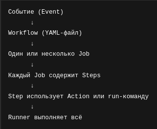

GitHub Actions is a Continuous Integration and Continuous delivery (CI/CD) platform that allows you to automate your build test and deploymnet pipeline

### Workflows

this is a yaml file which we will write all of our automation

A **worklows** is a configurable automated process that will run one or more jobs. Workflows are defined by a YAML file checked in your repository and will run when triggered by an event in you repository.

- A repository can have multiple workflows each which can perform a different set of tasks such as:
    - Builing and testing pull requests
    - Deploying your application every time a release is created
    - Adding a label whenever a new issue is opened

### Events

An event is a specific activity in a repository that triggers a workflow run. For example an activity can originate from GitHub when someone creates a pull request open an issue ot pushed a commit to a repository

### Jobs
A **job** is a set of steps in a workflow that is executed on the same runner. Each step is either a shell script that will be executed, or an action that will be run

### Actions
An **actions** is a custom application for the GitHub Actions platform that performs a complex but frequently repeated task.

### Runner
A runner is a server that runs your workflows when they're triggered. Each runner a single job at a time

  

