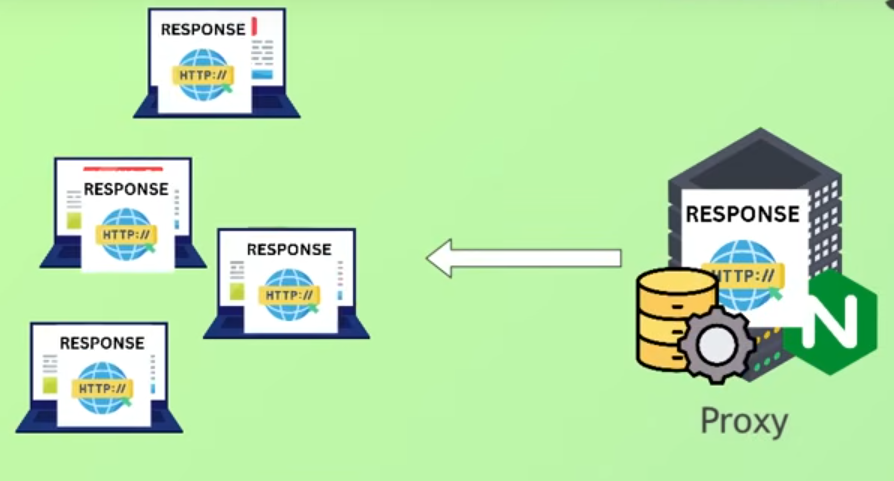

## NGINX as Web Server

A web server refers to both the physical machine and software running on the machine

Primary function it to server web pages to client browser's

 <br>

**NGINX is a high performance web server**

- Piece of software on a server, that handles HTTP requests
- NGINX as Load Balancer
    - Distributes incoming traffice across multiple backend servers
    - To balance the load, improve performance and provide redundancy
        - Least Connections
        
            Routes traffic to server with the fewest active connections

        - Round Robin

            Distributes client requests in a sequential, cyclical manner to each server in the group

"Proxy" = General term meaning acting on behalf of another

"Prox Server" = Intermidate server that forwards client requests to other servers


### **NGINX as Caching**

 <br>

Fetching data from remote servers or databases on each request results in slower response times

 <br>


## Nginx as Security

**Encryption Communication**

- Enforce encrypted traffic via (SSL/TSL)


## Functionalities of NGINX as a Proxy Server
### Load Balancing
### Caching
### Security
### Comperssion and Segmentation

## NGINX Configuration

- The main config file is typically named "nginx.conf" and is usually located in the "/etc/nginx" folder

- Using a custom syntax comprising


## Configuration of NGINX file

A few top-level directives, refered to as contexts group together the directives that apply to different traffic types:
- **events** - General connection processing
- **http** - HTTP traffic
- **mail** - Mail traffic
- **stream** - TCP and UDP traffic

Directives placed outside of these contexts are said to be in the main context

```conf
worker_processes 1;
```

**`worker_processes`** <br>
- Controls how many parallel processes Nginx spawns to handle client requests
- Instead of using a new process for every incoming connection, Nginx uses worker processes that handle many connections using a single-threaded event loop


**What does the number represent**
- The value is the number of worker processes Nginx should create
- Each worker process runs independently and can handle its own set of connections

**This configuration directly influences how well it can handle traffic (performance)**

`auto`

NGINX automatically detects the number of CPU cores available on the server and starts a corresponding number of worker nodes

```conf
worker_processes auto;
```

**`worker_connections`**

Per worker process: **how many simultaneous connections** can be opened

By default it will serve 512 clients

If you have 1 worker process, **you will be able to serve 1024 clients**

If you have 2 worker process you will be able to serve 2 * 1024 = 2048 clients
    
- But it will increase memory usage


```conf

worker_processes 1;

events {
    worker_connections 1024;
}

```


**Server Block**

- Defines how Nginx should handle requests for a particular domain or IP address

    How to listen for connections


```conf
worker_processes 1;

events {
    worker_connections 1024;
}

http {

    upstream nodejs_client {
        server 127.0.0.1:3001;
        server 127.0.0.1:3002;
        server 127.0.0.1:3003;
    }

    server {
        listen 8080;
        server_name localhost;

        location / {
            proxy_pass
        }
    }
}
```

**listen** --- The IP address and port on which the server will accept requests

**server_name** --- Which domain or IP address this server block should respond to

**location** --- The root (/) URL will apply to all requests unless more specific location blocks are defined

**Location Block** `proxy_pass` Tells Nginx to 'pass' the request to another server, making it act as a reverse proxy

**Upstrem Block** Upstream block defines a group of backend servers that will handle requests forwarded by Nginx


