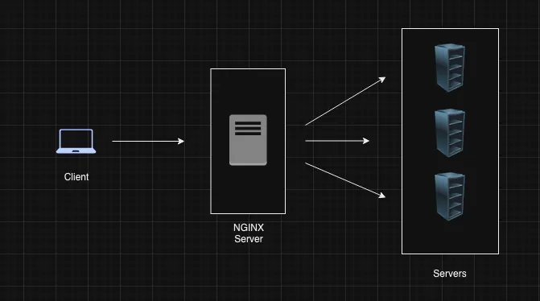

## Introduction to Nginx

Nginx is a robust and efficient web server that is widely used in modern web development

Nginx employs a non-threaded, event-driven architecture.

This design allows Nginx to handle many more connections simultaneously, making it high suitable for
high traffic websites

### Forward Proxy VS Reverse Proxy
To understand Nginx's role as reverse proxy, it's helpful to first distinguish between a forward proxy and a reverse proxy.

- **Forward Proxy**: In a traditional HTTP connection, a client sends a request directly to a server. However, with a forward proxy (such as a VPN) the client sends the request to the proxy, which then forwards it to the server. The server is unaware of the original client; it only interacts with the proxy. This setup is useful for privacy and by passing georestrictions.

 <br>

- **Reverse Proxy**: In contrast, a reverse proxy sits between the client and multiple servers. The client sends a request to the reverse proxy, which then decides which server should handle the request. Nginx is a popular choice for a reverse proxy because of its efficiency and flexibility.

***For example***

- `/admin` requests could be routed to Server 1
- `/settings` requests could be routed to Server 2

 <br>


### Advantages of Nginx

1. **High Concurrency**: Capable of handling 10,000 + concureent requests
2. **HTTP Caching**: Can cache HTTP requests, reducing server load and imporiving response time.
3. **Reverse Proxy**: Acts as a reverse proxy, routing clint requests to the appropriate server.
4. **Load balancing**: Distribues incoming requests across multiple servers to balance the load
5. **API Gateway** Can act as an API gateway managing and routing API requests.
6. **Static File Serving** Efficiently serves and caches static files like images and videos
7. **SSL Termination**: Handles SSL certicates providing secure connections to users


**Nginx Install**
```bash
sudo apt-get update
sudo apt-get install nginx # install nginx
sudo systemctl start nginx # start nginx
sudo systemctl status nginx # status nginx
```


The main configuration file for Nginx is `nginx.conf`. It's typically located in `/etc/nginx/nginx.conf`. Let's break a simple Nginx Configuration file


```bash
worker_processes auto;

events {
    worker_connections 1024;
}

http {
    include mime.types;
    default_type application/octet-stream;
    sendfile on;
    keepalive_timeout 65;

    server {
        listen 80;
        server_name localhost;

        location / {
            root /usr/share/nginx/html;
            index index.html index.htm;
        }
    }
}
```

`worker_processes auto;` This directive tells Nginx how many worked processes to start. Worker processes are responsible for handling requests. Setting it to auto allows Nginx to automatically determine the optimal number based on your CPU cores.


`events {worker_connection 1024; }` 

The event Block sets the connection handling settings

- `worker connection 1024;` means that each worker process can handle 1024 simultaneous connections  If you have 4 workers processes you can handle 4096 connection concurently

`http { ... }`

- The http block is where you define settings for handling HTTP requests. This is where most of your web server's configuration will reside.

`include mime.types`

- This directives tells Nginx to include a file called mime.types, which maps file extensions to MIME types. MIME types tell the browser how to handle different types of file (e.g. html jpg)


`default_type application/octet-stream;`

- If Nginx can’t determine the MIME type of a file, it will use `application/octet-stream` as a fallback, which generally means "download this file."


Now let’s talk about the server block which is most important part of the file:

```bash
server {
    listen       80;
    server_name  localhost;

    location / {
        root   /usr/share/nginx/html;
        index  index.html index.htm;
    }
}
```

`server { ... }`

The server block defines the configuration for a virtual server, i.e., a server that will handle requests for a particular domain or IP address.

`listen 80;`

This tells Nginx to listen for HTTP requests on port 80. Port 80 is the default port for HTTP.

`server_name localhost;`

The server_name directive specifies the domain name that this server block will respond to. localhost is typically used for local testing, but in a real-world scenario, you'd replace it with your domain name (e.g., example.com).

`location / { ... }`

The location block is used to define how to respond to different request URIs. The / means that this block will handle requests to the root URL (e.g., http://localhost/).

**root /usr/share/nginx/html;**


The root directive specifies the directory where Nginx should look for files to serve. Here, it's set to /usr/share/nginx/html, which is the default directory where Nginx stores HTML files.
index index.html index.htm;


The index directive lists the files Nginx should look for if a directory is requested. For example, if a user navigates to http://localhost/, Nginx will try to serve index.html or index.htm from the root directory.